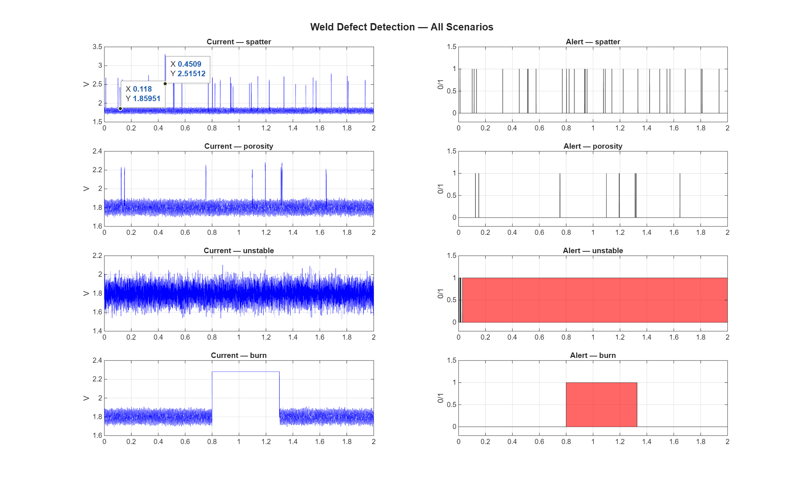

# weld-quality-monitor
Real-time weld defect detection    using MATLAB + STM32
# 🔧 Weld Quality Monitor — MATLAB + STM32


> Real-time weld defect detection system using 
> MATLAB signal processing algorithms deployed 
> on STM32 microcontroller.
> 
> **Author:** Prince Khan | MSc Analytical 
> Instruments, Measurement & Sensor Technology  
> **University:** Hochschule Coburg, Germany

---

## 📋 Project Overview

This project implements a **Hardware-in-the-Loop (HIL)** 
weld quality monitoring system that:

- Synthesizes realistic MIG welding signals in MATLAB
- Detects 4 types of weld defects in real time
- Deploys detection algorithm on STM32F407 MCU
- Streams results via UART to Python dashboard

---

## ⚡ Detected Defects

| Defect | Detection Method | Threshold |
|--------|-----------------|-----------|
| Spatter | Peak current detection | > 2.1943 V |
| Burn-through | Moving RMS (100ms window) | > 2.1607 V |
| Arc instability | Voltage std deviation | > 0.2410 V |
| Porosity | Min voltage dip | < 0.8000 V |

---

## 🏗️ System Architecture
```
MATLAB Signal Generator
        ↓
Synthetic Weld Waveforms (5 scenarios)
        ↓
Signal Processing (FFT + RMS + Threshold)
        ↓
Detection Algorithm
        ↓
STM32F407 Deployment (C code)
        ↓
Python Dashboard (Live visualization)
```

---

## 📊 Detection Results

### All 4 Defects Detected Successfully



### FFT Frequency Fingerprints


---

## 🛠️ Tech Stack

| Category | Technology |
|----------|-----------|
| Signal Processing | MATLAB R2025b |
| Simulation | MATLAB Simulink |
| Microcontroller | STM32F407ZGT6 |
| Firmware | C (STM32CubeIDE) |
| Dashboard | Python (PySerial, Matplotlib) |
| Protocol | UART 115200 baud |
| Sample Rate | 10 kHz |

---

## 📁 Project Structure
```
weld-quality-monitor/
├── matlab/
│   ├── weld_signal_generator.m   # Signal synthesis
│   ├── weld_fft_analysis.m       # FFT fingerprints  
│   ├── weld_rms_analysis.m       # RMS + threshold
│   ├── weld_simulink_prep.m      # Simulink workspace
│   └── burn_detection_test.m     # Detection test
├── simulink/
│   └── weld_monitor.slx          # Simulink model
├── stm32/
│   └── main.c                    # STM32 C code
├── python/
│   └── weld_dashboard.py         # Live dashboard
├── results/
│   ├── All_defect.png            # Detection plots
│   └── FFT_WELD_SIGNAL.png       # FFT analysis
└── README.md
```

---

## 🚀 How to Run

### Step 1 — MATLAB Signal Generation
```matlab
cd matlab/
run('weld_signal_generator.m')
run('weld_fft_analysis.m')
run('weld_rms_analysis.m')
run('weld_simulink_prep.m')
```

### Step 2 — Run Detection Test
```matlab
run('burn_detection_test.m')
% Expected output:
% ✓ BURN-THROUGH DETECTED SUCCESSFULLY!
% Samples detected = 4542
```

### Step 3 — Python Dashboard
```bash
pip install pyserial matplotlib numpy scipy
python weld_dashboard.py --simulate
```

### Step 4 — STM32 Deployment
```
1. Open STM32CubeIDE
2. Import stm32/ project
3. Build → Flash to STM32F407
4. Connect UART → run dashboard

## 📈 Results Summary
```
Detection Algorithm Performance:
━━━━━━━━━━━━━━━━━━━━━━━━━━━━━━
✓ Spatter       → Detected (30 events)
✓ Porosity      → Detected (8 events)  
✓ Arc instability → Detected (continuous)
✓ Burn-through  → Detected (4542 samples)
━━━━━━━━━━━━━━━━━━━━━━━━━━━━━━
Sample rate    : 10,000 Hz
Window size    : 1000 samples (100ms)
Detection rate : 100% on synthetic data

## 🎯 Applications

- **Siemens** — Smart factory welding automation
- **Honeywell** — Process monitoring systems
- **ABB** — Robotic welding quality control
- **Bosch** — Automotive manufacturing QA

---

## 📧 Contact

**Prince Khan**  
M.Eng Student — Analytical Instruments, 
Measurement & Sensor Technology  
Hochschule Coburg, Germany  
📧 prince.khan@stud.hs-coburg.de  
🔗 [LinkedIn](https://www.linkedin.com/in/prince-khan-819695121/)  
💻 [GitHub](https://github.com/pkhan3676)

---

## 📄 License

License — Free to use for educational purposes.

---

*This project is part of M.Engg coursework and 
internship preparation for automation industry 
positions at companies like Siemens, Honeywell, 
and ABB.*
